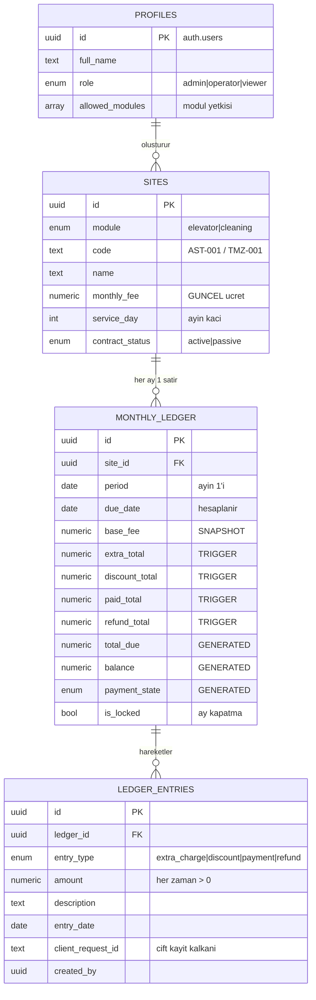

# Elevator360 — Veritabanı Mimarisi

> Durum: **Adım 1 tamamlandı** — şema tasarlandı, gerçek Postgres 16 üzerinde
> 19 senaryo ile test edildi, eski Excel verisiyle mutabakat sağlandı.
> Sonraki adım: Expo (React Native) uygulama katmanı.

---

## 1. Verilen Kararlar

| Konu | Karar | Gerekçe |
|---|---|---|
| Modül ayrımı | **Tek şema + `module` kolonu** (discriminator pattern) | İş mantığı %90 aynı; kod, trigger, view ve ekran bir kez yazılır. 3. modül eklemek tek satır. |
| Backend | **Supabase (PostgreSQL)** | İlişkisel bütünlük + hazır Auth + RLS. Ücretsiz plan bu ölçek için fazlasıyla yeterli (500 MB DB; bu veri seti < 5 MB). |
| Kimlik | **Supabase Auth + RLS** | 3-5 kişi, e-posta/şifre. Her kaydın "kim girdi" izi tutulur. |
| Finans modeli | **Hareket defteri + otomatik özet** | Toplamlar elle değil, hareketlerden hesaplanır. Muhasebe standardı. |

### Ücretsiz plan uyarısı
Supabase ücretsiz projeler **1 hafta hiç istek almazsa duraklatılır (pause)** ve panelden
elle uyandırılması gerekir. Günlük kullanılan bir sistemde bu yaşanmaz; yine de
tatil/uzun ara dönüşünde ilk açılış birkaç dakika sürebilir. Kritik hale gelirse
Pro plana (25 $/ay) geçiş veya haftalık bir "ping" görevi çözer.

---

## 2. Tablo Yapısı



**Okuma biçimi:** `sites` = kim. `monthly_ledger` = o ayın bilançosu (site başına **tek** satır).
`ledger_entries` = o ayın içindeki tek tek hareketler. Bilanço satırındaki hiçbir tutar
elle yazılmaz; hareketlerden **her seferinde sıfırdan** toplanır.

---

## 3. Veri Bütünlüğünü Koruyan 7 Katman

Senin en çok dert ettiğin nokta buydu ("üst üste bakım ücreti eklensin, hesap bozulmasın").
Tek bir önlem değil, birbirini yedekleyen yedi katman var:

| # | Katman | Ne engelliyor |
|---|---|---|
| 1 | `UNIQUE (site_id, period)` | Aynı siteye aynı ay ikinci satır açılmasını. Veritabanı seviyesinde; uygulama hatası bile delemez. |
| 2 | `client_request_id UNIQUE` | Mobilde çift dokunma / ağ tekrarı sonucu aynı tutarın iki kez işlenmesini. |
| 3 | **Full recompute trigger** | Toplamların kayması (drift). `+=` yapılmaz; her değişimde `SUM()` ile baştan hesaplanır. |
| 4 | `GENERATED ALWAYS` kolonlar | `total_due`, `balance`, `payment_state` Postgres tarafından hesaplanır — yanlış yazılamaz. |
| 5 | **Kolon bazlı GRANT** | Kullanıcılara `monthly_ledger` üzerinde yalnızca `notes` yazma yetkisi verilir. Tutar kolonlarına yazma yetkisi **hiç kimsede yok**. |
| 6 | `base_fee` snapshot + `set_site_fee()` | Zam yapılınca geçmiş ayların bozulmasını. (Eski Excel'in en büyük hatası buydu.) |
| 7 | `is_locked` + `audit_log` | Kapatılmış ayın değişmesini; ve her değişikliğin izsiz kalmasını. |

### Eşzamanlılık testi
20 kullanıcı **aynı anda** aynı siteye 50 ₺ ekstra + 100 ₺ ödeme girdi.
Sonuç: **1 bilanço satırı, ekstra tam 1.000,00 ₺, tahsilat tam 2.000,00 ₺, 40 hareket, 0 hata.**
Kayma yok.

---

## 4. Uygulama Katmanının Kullanacağı Fonksiyonlar

Uygulama tablolara doğrudan `INSERT/UPDATE` atmaz; bu fonksiyonları çağırır.

| Fonksiyon | Ne yapar |
|---|---|
| `open_period(module, period)` | Ay başında aktif tüm siteler için bilanço satırı açar. Aynı ay ikinci kez çalıştırılsa yeni satır **açmaz**. |
| `post_transaction(...)` | **"İlave İşlem / Ödeme Ekle" modalının tek çağrısı.** Satır yoksa açar, varsa üstüne ekler. |
| `apply_payment_fifo(site, tutar)` | Birikmiş borcu toptan ödeyen müşteride ödemeyi **en eski aydan** başlayarak dağıtır. |
| `reverse_entry(entry_id, sebep)` | Hatalı kaydı silmeden ters kayıtla iptal eder (iz kalır). |
| `set_site_fee(site, yeni_ucret, gecerlilik_ayi)` | Zam. Geçmiş aylara **dokunmaz**. |
| `close_period(module, period)` / `reopen_period(...)` | Ay kapatma / (sadece admin) yeniden açma. |
| `ensure_current_period(module)` | **Uygulama her açılışta çağırır.** Eksik ayları otomatik açar; kullanıcı hiçbir şeye basmaz. |
| `post_adjustment(...)` | İndirim / para iadesi girişi (borcu ya da tahsilatı azaltır). |
| `deactivate_site(site, gecerlilik_ayi)` | Siteyi listeden çıkarır. **Geçmiş aylara dokunmaz.** |
| `reactivate_site(site, baslangic_ayi)` | Sözleşmeyi yeniden başlatır. |
| `waive_period_fee(site, period, sebep)` | "Bu ay hizmet verilmedi" — sadece sabit ücreti muaf tutar. |

```js
// React Native / Expo tarafından kullanımı:
const { data, error } = await supabase.rpc('post_transaction', {
  p_site_id: siteId,
  p_period: '2026-09-01',
  p_extra: 5000,            p_extra_desc: 'Motor revizyonu',
  p_payment: 2000,          p_payment_desc: 'Elden tahsilat',
  p_client_request_id: uuid // çift dokunma kalkanı — her modal açılışında bir kez üret
});
```

## 4b. Aylık Liste ve Site Ekleme / Çıkarma Akışı

**Kullanıcı her ay siteleri tek tek girmez.** Liste kendiliğinden gelir:

- Uygulama açıldığında `ensure_current_period(module)` çağrılır. Son açılmış aydan
  bugüne kadar eksik ne varsa açar; zaten açık olan aya hiçbir şey yapmaz.
  Üç ay uygulamaya girilmese bile dönüşte eksik aylar tamamlanır.
- Yeni bir siteyle sözleşme yapılırsa, site kaydedildiği anda **cari ayın listesine
  kendiliğinden düşer** (trigger).
- Kullanıcının o ay yaptığı tek iş: değişen sitelere ekstra/tahsilat/indirim girmek.

**Site çıkarma — geçmişi bozmadan.** Eski sistemdeki en can sıkıcı hata buydu:
listeden bir site çıkarılınca geçmiş ayların kayıtları da gidiyordu. Yeni yapıda:

| Yapılan | Sonuç |
|---|---|
| `deactivate_site(site, '2026-10-01')` | Sözleşme 30.09.2026'da biter. **Mart–Eylül bilançoları aynen durur.** Ekim ve sonrasındaki *hiç hareket görmemiş boş* tahakkuklar temizlenir. |
| O ileri aylardan birinde ekstra/tahsilat varsa | **Silinmez, korunur** ve fonksiyon `kept_periods_with_data` ile bunu raporlar. |
| Sonraki ayların `open_period` çağrıları | Pasif siteyi listeye **almaz**. |
| Siteyi tamamen silme denemesi | **Reddedilir** (yetki + `ON DELETE RESTRICT`). Sözleşme biter, kayıt kalır. |
| `reactivate_site(site, '2026-12-01')` | Aralık'tan itibaren tekrar listeye girer; arada geçen aylar geriye dönük açılmaz. |

Tek bir ay için ücret alınmayacaksa site çıkarılmaz — `waive_period_fee()` kullanılır:
sabit ücret kadar indirim kaydı düşülür, o ayki ekstra/parça tutarları aynen durur,
satır silinmez ve sebebiyle birlikte iz kalır. Aynı aya iki kez uygulansa da ücret
bir kez düşer.

---

## 5. Ekranların Veri Kaynakları

| Ekran | Kaynak | Not |
|---|---|---|
| Liste + dropdown filtre | `v_ledger` | `status_key` ile filtre, `status_label` ile gösterim. Sırala: `updated_at desc`. |
| Dashboard kartları | `v_period_summary` | Toplam alacak / tahsil / kalan / tahsilat oranı. |
| Grafik (aylık trend) | `v_monthly_trend` | Dönem bazında beklenen-tahsil-kalan + kümülatif. |
| Devreden alacak | `v_site_receivables` | `carried_over` = geçmiş aylardan devir. **Saklanmaz, hesaplanır** — geçmiş bir ay düzelince devir kendiliğinden düzelir. |
| Tahsilat önceliği | `v_aging` | 30/60/90+ gün yaşlandırma. |
| "Bu tutar nereden geldi?" | `v_entry_detail` | Hareket dökümü + kim girdi. |

Durum etiketleri (`status_label`): `Bekliyor`, `Eksik Ödeme`, `Gecikmiş`, `Gecikmiş (Eksik)`,
`Tamamlandı`, `Fazla Ödeme`. Gecikme **saklanmaz**, her sorguda `due_date` ile güncel hesaplanır —
böylece dün "Bekliyor" olan kayıt bugün kendiliğinden "Gecikmiş" olur.

---

## 6. Kurulum

1. **Supabase projesi aç** → SQL Editor.
2. Migration'ları **sırayla** çalıştır:
   `0001_schema.sql` → `0002_functions.sql` → `0003_views.sql` → `0004_rls.sql` → `0006_period_automation.sql`
3. **Kullanıcıları oluştur** (Authentication → Users). Her kullanıcı için `profiles` satırı
   otomatik açılır; sonra rol ve modül yetkisini ayarla:
   ```sql
   update public.profiles
      set role = 'admin',
          allowed_modules = array['elevator','cleaning']::module_type[]
    where id = '<user-uuid>';
   ```
4. **Eski veriyi aktar** (opsiyonel): `supabase/seed/0005_seed_elevator.sql` dosyasını çalıştır.
   Dosya `build_seed.py` ile Excel'den üretilir; tekrar çalıştırılabilir (idempotent).
5. Temizlik modülünün siteleri uygulamadan ya da benzer bir seed ile eklenir — **şema aynen hazır**.

### Aylık rutin
**Elle yapılacak bir şey yok.** Uygulama her açılışta `ensure_current_period(module)`
çağırır ve eksik aylar otomatik açılır. Gerekirse elle de tetiklenebilir:
`select * from public.ensure_current_period('elevator');`

---

## 7. Eski Veriden Çıkan Bulgular

`old_data/Asansör - Final.xlsx` incelendi (107 site, 21 hareket kaydı):

1. **Geçmiş aylar bugünkü ücretten hesaplanıyordu.** Özet sayfasında her ay için toplam alacak
   222.960 ₺ çıkıyordu — yani bir siteye zam yapılsa geçmiş 6 ayın bilançosu da değişirdi.
   → Yeni şemada `base_fee` snapshot ile çözüldü.
2. **Öksüz kayıt (orphan record) tespit edildi.** `AST-108` kodlu 4 harekette (2.131 ₺ ekstra,
   30 ₺ tahsilat) site tanımı yoktu — muhtemelen site silinmiş, hareketleri kalmıştı.
   → Aktarımda bu tutarlar atılmadı; pasif bir `[KAYIP SITE] AST-108` kaydı altında korundu.
   **Bu kayıtları doğru siteyle eşleştirip pasife alman gerekiyor.**
   → Yeni şemada bu durum imkânsız: `ledger_entries → monthly_ledger → sites` zinciri ve
   `ON DELETE RESTRICT` buna izin vermez.
3. Aktarım mutabakatı: ekstra **478.151,00 ₺**, tahsilat **124.850,00 ₺** — Excel ham verisiyle
   kuruşu kuruşuna aynı.
4. Eski veride 100.000 / 111.111 / 7.777 gibi **test rakamları** var. Bunlar bilinçli
   olarak girilmiş deneme verisi; düzeltmeye çalışmaya gerek yok. Sistem devreye
   alınırken gerçek tutarlarla temiz bir aktarım yapılacak — `build_seed.py` yeniden
   çalıştırılıp güncel Excel'den seed üretmek yeterli.

---

## 8. Test Kapsamı

Şema, gerçek Postgres 16 üzerinde aşağıdaki senaryolarla doğrulandı:

- Otomatik site kodu üretimi (AST-001 / TMZ-001)
- Aynı isimde ikinci site → **reddedildi** (büyük/küçük harf ve boşluk farkı dâhil)
- `open_period` iki kez → ikinci çalıştırmada yeni satır açılmadı
- Vade tarihi ay sonu taşması: hizmet günü 31 → Şubat'ta 28'e çekildi
- Ekstra + tahsilat girişi → tek satırda toplandı, yeni satır açılmadı
- Aynı isteğin tekrarı (çift dokunma) → **reddedildi**
- Yanlış kayıt silindi → toplam kendini düzeltti
- Zam → cari ay güncellendi, **geçmiş ay değişmedi**
- Toplu tahsilat → en eski aydan başlayarak dağıtıldı
- Tutar kolonunu elle değiştirme → **yetki reddi**
- Kapatılmış aya yazma → **reddedildi**
- Temizlik yetkili kullanıcı asansör verisini **göremedi**, işlem **giremedi**
- 20 eşzamanlı işlem → tutarlar tam, kayma yok
- Denetim izi: her ekleme/silme `audit_log`'a düştü
- Gerçek veri (107 site) ile mutabakat: **tam**

Dönem otomasyonu ve site çıkarma (0006) için ek senaryolar:

- Hareketi olmayan site Ekim'den itibaren çıkarıldı → Mart–Eylül **aynen durdu**, boş Ekim/Kasım temizlendi
- Ekim'de 100.000 ₺ hareketi olan site çıkarıldı → **Ekim korundu**, boş Kasım temizlendi, geçmiş bozulmadı
- Pasif siteler sonraki dönemlerin listesinde **çıkmadı**
- Site geri açıldı → belirtilen aydan itibaren listeye girdi, geçmiş bozulmadı
- Cari ayın satırları silindi → `ensure_current_period` hepsini **otomatik geri açtı**
- Yeni site eklendi → cari ay satırı **kendiliğinden açıldı**
- `waive_period_fee` iki kez çağrıldı → ücret **bir kez** düşüldü, ekstralar korundu
- `post_adjustment` indirim girişi + aynı isteğin tekrarı → **reddedildi**

---

## 9. Sonraki Adım

Expo (React Native) tarafı. Sırasıyla:
Auth ekranı → Modül seçimi → Site listesi (filtre + sıralama) → Hızlı kayıt modalı →
Dashboard → Site yönetimi. NativeWind + Expo Router ile tek kod tabanı (iOS / Android / Web).
